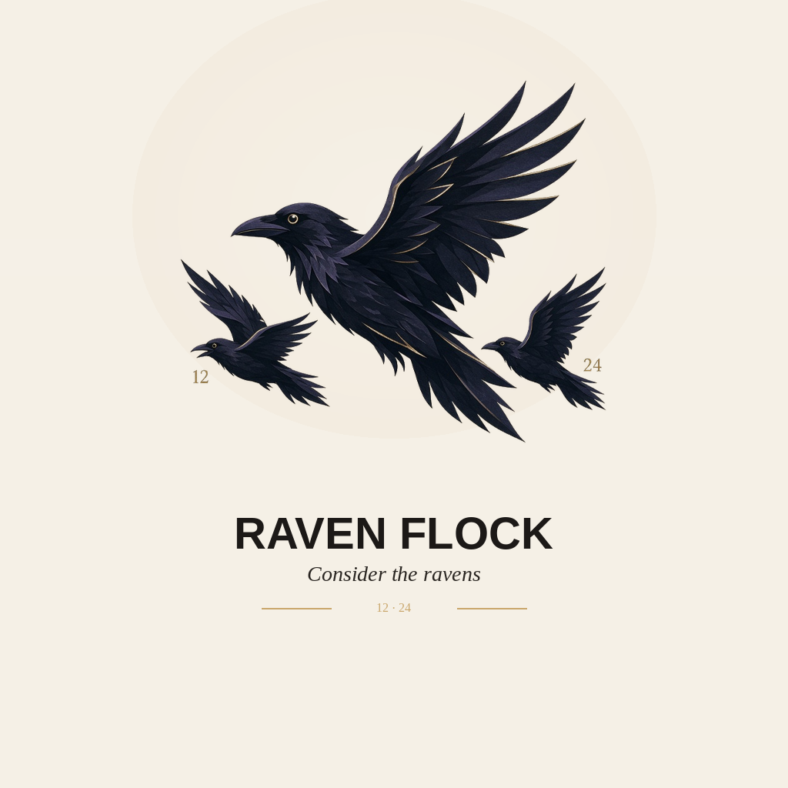

  

<h1 align="center">Raven Flock</h1>

<strong>Raven Flock — warm indie games. Consider the ravens.</strong>

---

### In the shop

- [Stillpoint](https://dust2ash7.github.io/Meditation-App/) — timed sits, box breathing, wind-down
- [2048](https://dust2ash7.github.io/2048-puzzle/) — a calm, premium take on 2048
- [Space Fish](https://dust2ash7.github.io/space-fish/) — a quiet neon space shooter
- [Mochi Drop](https://dust2ash7.github.io/mochi-drop/) — drop and merge mochi
- [Buy me a coffee](https://www.buymeacoffee.com/nrsteward) — optional. Tips keep the flock building.

### About

Quiet games and tools from Vista / San Diego County. The name nods to Luke 12:24 — care, not hustle.

  
   
  Raven Flock · Vista / San Diego County

